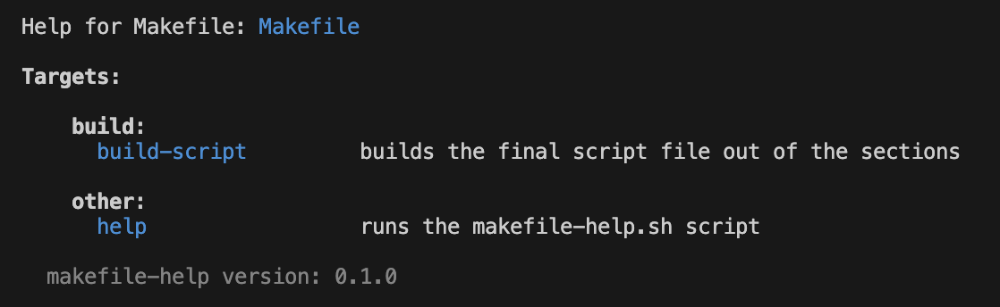

# makefile-help.sh

`makefile-help.sh` is a shell script designed to extract and display help 
information from Makefile targets. It generates a dynamically updated help 
menu for users, detailing available targets and their purposes.

**Disclaimer:** Currently it only supports simple named targets ex: `mytarget: ## doc`

## Example:
```shell
    $ make help
```
Would output something like this:


## Installation

To use this script, include it in your project directory and add the 
following to your Makefile:

```makefile
.PHONY: help
help: ## Display this help.
    @sh makefile-help.sh $(MAKEFILE_LIST)
```
**Note:** Make sure there is a tab before @sh...

Then you just need to type `make help` in your terminal.

## Target Documentation Format
Document your Makefile targets in the following format:

```makefile
<target-name>: ## <description>
```

For example:

```makefile
build: ## Compile the project.
```

If a target name includes a dash ('-'), the part before the first dash is
treated as a group label. Targets under the same group will be listed
together under that group name. If no group is specified, targets will be
listed under the 'Other' category.

## Requirements
* grep
* awk
* A POSIX-compliant shell
* Python (optional but recommended)

## Author

Per Arneng

## Licence

MIT
